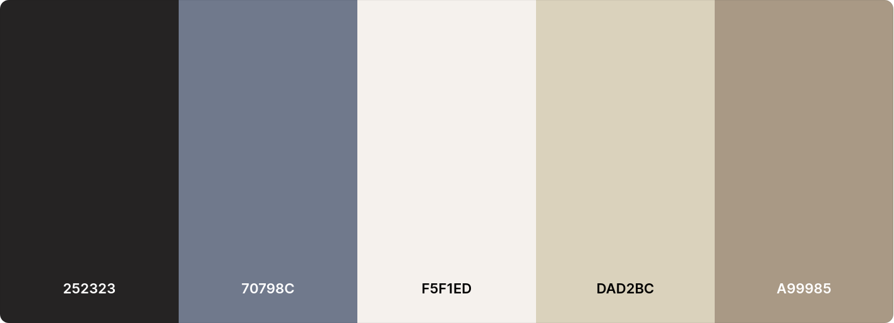

# Mundorum Palette

https://coolors.co/user/palettes/65057ffe44577c000b1df9f4
https://colordesigner.io/#252323-70798C-F5F1ED-DAD2BC-A99985

* raisin-black: #252323ff
* slate-gray: #70798cff
* isabelline: #f5f1edff
* bone: #dad2bcff
* khaki: #a99985ff

## Isabelline to Raisin Black

* token: color.base.isabelline_raisin
* tool: [Gradient Generator](https://colordesigner.io/gradient-generator/?mode=lch#F5F1ED-252323)
  * mode: LCH
  * isabelline (#f5f1edff) to raisin-black (#252323ff) - 10 colors

## Slate Grey

* token: color.base.slate_grey
* tool: [Palette Generator](https://colordesigner.io/#252323-70798C-F5F1ED-DAD2BC-A99985)
  * mode: LCH
  * 5 lighter colors from tints (first 5) 
  * 4 darker colors from shades (fisrt 4 jumping 2)